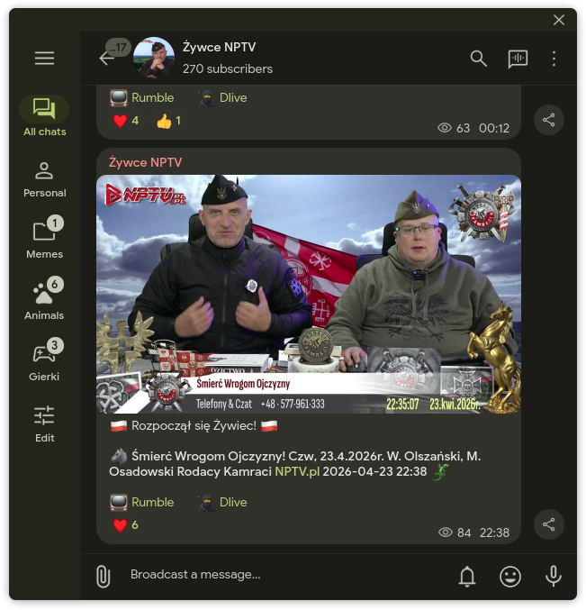
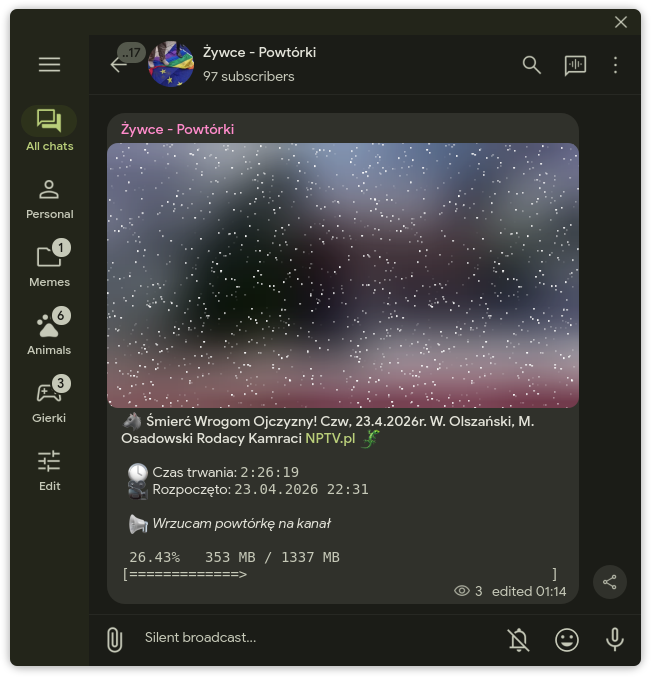
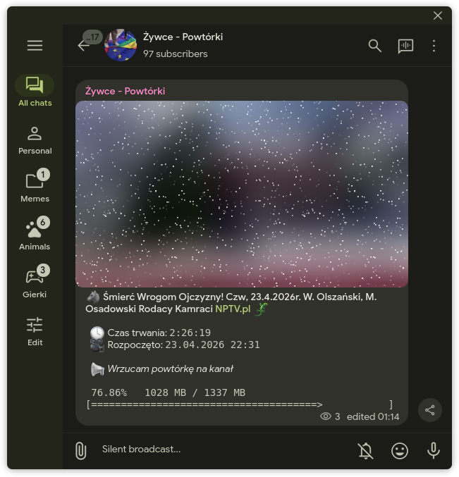
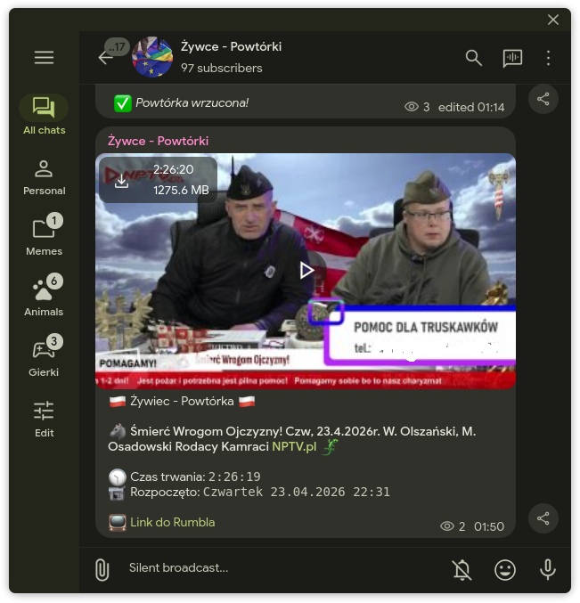

# nptw

**Telegramowy bot, który wysyła powiadomienia i wrzuca powtórki z Żywców [NPTV](https://nptv.pl/)**

- **Kanał z powiadomieniami na [@zywce](https://t.me/zywce)**

- **Kanał z powtórkami na [@nptv_archive](https://t.me/nptv_archive)**

## Funkcje

🔔 powiadomienie do 10 minut po rozpoczęciu żywca

📦 pełny live wrzucony na kanał zaraz po zakończeniu nadawania

🎭 informacje na temat streama tj. tytuł, długość i kiedy się zaczął

🏞️ dynamiczne miniaturki!

📹 transkodowanie w locie do wybranego formatu i maksymalnego rozmiaru pliku

💻 akceleracja sprzętowa obsługująca Intel QuickSync, VAAPI i NVENC

📝 wszystko konfigurowalne jednym plikiem konfiguracyjnym :>


## Intro

Bot korzysta z serwisu Rumble, na którym nadają Kamraci, tam co x minut sprawdza czy ktoś nadaje, i jeśli coś się zaczęło, śle powiadomienie na Telegrama wraz z linkami do żywca

Rumble niby ma powiadomienia email, ale Telegram jakoś ma większą szansę, że przyjdzie bez ogromnych opóźnień

Projekt korzysta z **yt-dlp** do scrapowania Rumbla, oraz z **ffmpeg** do transkodowania pliku wideo w locie (telegram ma limit 2GB, a i mniejszy plik jest mniej bolesny do pobrania)


## Wymagania

**💾 około 4-6GB wolnej przestrzeni na dysku** (lub w tempie) do trzymania oryginalnych fragmentów streamu (które są w najczęściej wysokiej jakości)

**🖥️ 1GB pamięci RAM** już powinno spokojnie wystarczyć

**🧠 co najmniej 2 rdzenie** żeby transcoding się nie udławił

**🎮 grafika z akceleracją sprzętową** - QSV, VAAPI lub NVENC; choć opcjonalne, transcoding na CPU zazwyczaj nie jest dobrym pomysłem

**🐧 Jakikolwiek Linux** bo nie używam windowsa, choć odpalenie programu na windowsie może się udać, mam go w d...

**🔧 Program sam pobierze sobie _dependencies_** więc nie trzeba niczego doinstalowywać


## Uruchamianie

1. W [Releases](https://github.com/dani3l0/nptw/releases) można znaleźć już skompilowaną binarkę na linux-amd64, którą wystarczy pobrać

2. Aby uruchomić binarkę, najlepiej jest utworzyć oddzielny folder i dać jej uprawnienia do uruchamiania

```
mkdir NPTW        # nowy folder
mv nptw NPTW      # przeniesienie binarki do folderu powyżej
cd NPTW           # wejście do środka folderu
chmod +x nptw     # nadanie uprawnień do uruchamiania
```

3. Pierwsze uruchamianie

Program utworzy sobie pełny plik konfiguracyjny, w którym należy zmienić kilka rzeczy

Aby uruchomić wystarczy

```
./nptw
```

4. Konfiguracja

Przejdź do sekcji [Konfiguracja](#Konfiguracja)

5. Kolejne uruchomienie

Program jest już skonfigurowany i gotowy do uruchomienia na dłużej. Jednak, pierwsze uruchomienie już po konfiguracji zajmie chwilę dłużej, bo program musi pobierać sobie najnowsze **ffmpeg** i **yt-dlp**

```
./nptw
```

**i gotowe!**

## Konfiguracja

Plik **config.yaml** utworzy się automatyczniie przy pierwszym uruchomieniu programu

**Domyślny plik konfiguracyjny** wygląda tak:

```
rumble_url: https://rumble.com/c/RodacyKamraciPL
dlive_url: https://dlive.tv/nptvpl
telegram_bot_token: ur_token_goes_here
telegram_api_id: 123456
telegram_api_hash: some_very_long_secret_hash
respond_to_user_messages: true
notifications_enabled: true
notifications_channel_id: 123456789
notifications_live_thumb: true
replays_enabled: true
replays_channel_id: 456789
max_replay_size_mb: 1600
cache_path: ./cache
ytdlp_threads: 1
ffmpeg_hwaccel_type: cpu|qsv|vaapi|cuda
ffmpeg_threads: 0
ffmpeg_format: h264|hevc|av1
poll_time: 10
download_progress_refresh_sec: 10
log_level: error|warn|info|verbose
debug_notifications: false
debug_replays: false
```

- **`rumble_url`** - pełny link do kanału/streamera, o którym chcemy być informowani
- **`dlive_url`** - alternatywny link do serwisu DLive , służy tylko przy wysyłaniu powiadomienia; jeśli nie chcesz tego linku, ustaw puste (`""`)
- **`telegram_bot_token`** - token do bota utworzonego w [@BotFather](https://t.me/BotFather)
- **`telegram_api_id`** - program korzysta z MTProto żeby wrzucać duże pliki (Bot API pozwala tylko na 50MB). Wejdź do https://my.telegram.org/apps i stamtąd skopuj **App api_id**
- **`telegram_api_hash`** - to samo co z powyższym, z tą różnicą że należy tu wkleić **App api_hash**
- **`respond_to_user_messages`** - taki fajny _Easter Egg_ w czacie z botem :P
- **`notifications_enabled`** - czy powiadomienia mają być włączone
- **`notifications_channel_id`** - ID kanału, na który mają być wysyłane powiadomienia
- **`notifications_live_thumb`** - czy pobierać aktualną miniaturkę ze streamu
- **`replays_enabled`** - czy pobieranie wrzucanie powtórki ma być włączone
- **`replays_channel_id`** - ID kanału na którym mają być pełne pliki wideo z powtórkami
- **`max_replay_size_mb`** - maksymalny rozmiar streamu; program sam dostosuje bitrate, żeby nigdy nie przekroczyć ustawionego rozmiaru (limit Telegrama to 2048MB)
- **`cache_path`** - ścieżka do folderu na dysku (lub tmpfs), gdzie są trzymane pliki tymczasowe streamu (te 4-6GB o których było pisane wcześniej)
- **`ytdlp_threads`** - ilość wątków yt-dlp; więcej wątków oznacza większy rozmiar cache; nie polecam ustawiać tego więcej niż 2
- **`ffmpeg_hwaccel_type`** - **wybierz jedno**. `cpu` oznacza brak akceleracji sprzętowej (niezalecane, tylko w ostateczności gdy pozostałe opcje nie działają); `qsv` jeśli masz grafikę Intela (np. zintegrowaną UHD); `vaapi` jeśli używasz AMD lub innej, lub QSV nie działa; `cuda` jeśli masz grafikę od NVIDII
- **`ffmpeg_threads`** - liczba wątków ffmpeg podczas transkodowania; **0** oznacza automatycznie (ilość wątków równa liczbie rdzeni; od 4 rdzeni wzwyż liczba rdzeni dzielona przez 2)
- **`ffmpeg_format`** - **wybierz jedno**. To format kompresji wideo; **h264** ma największą kompatybilność, ale i najgorszą jakość przy tym samym rozmiarze; **hevc** jeśli chcesz lepszą jakość, ale jest najwolniejszy; **av1** jeśli chcesz najlepszą jakość (ten kodek jest dosyć nowy, więc może mieć problemy z odtwarzaniem na starszych urządzeniach)
- **`poll_time`** - co ile minut bot ma sprawdzać czy jest stream na Rumblu
- **`download_progress_refresh_sec`** - co ile sekund ma się aktualizować progress bar w wiadomości podczas wrzucania powtórki
- **`log_level`** - **wybierz jedno**. `warn` lub `info` powinny wystarczająco informować co się dzieje w aplikacji
- **`debug_notifications`** - do developmentu. pomija pętlę, sprawdza tylko czy stream jest online, wysyła powiadomienie i program kończy pracę. Jeśli nie jest, użyj po prostu innego kanału :P
- **`debug_replays`** - do developmentu lub jeśli ostatni stream nie wrzucił się poprawnie; pomija pętlę i wrzuca ostatni stream na kanał z powtórkami; po zakończonym uploadzie program kończy pracę

## Screenshoty

### 1. Powiadomienie



### 2. Upload (z paskiem postępu i obecną czynnością)




### 3. Gotowe



-----

_program napisany hobbyistycznie i nie ma na celu propagowania żadnych poglądów ani obrażania nikogo_
